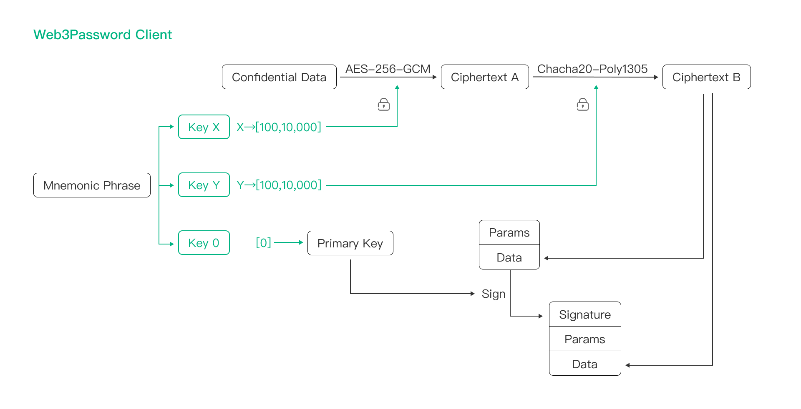

# Web3Password Security Whitepaper

## Origin

> In 2022, a password manager company was hacked, resulting in many accounts being brute-forced and significant losses occurring. Therefore, key derivation from master password is insufficient. Even with PBKDF2 or Argon2, they still have huge security issues. Consequently, Web3Password has designed a Zero Trust Architecture("ZTA") that can be applied to password manager. Based on this ZTA, we have brought a revolutionary password manager - Web3Password.

> Currently, approximately $700 billion worth of cryptocurrency is secured by BIP39/BIP44 Mnemonic Phrase of Bitcoin. Mnemonic Phrase has been well proven to be strong, safe and effective. Hence, we have good reasons to believe that Web3Password, based on Mnemonic Phrase, could secure your data effectively. It  also could solve your security and policy concerns all about password managers.

## Account Security Principle of Web3Password

- Brand-new Passkey Account

> Web3Password innovatively introduces BIP39/BIP44 Mnemonic Phrase of Bitcoin into the Web3Password account system and utilizes it to develop a passkey account system based on ECDSA. So Web3Password provides an account system endorsed by Bitcoin, which makes Web3Password's account system as secure as Bitcoin. The Mnemonic Phrase is only controlled by you, and only stored on your own device. Not even Web3Password can access it.

> Web3Password has entirely abandoned insecure authentication such as Email, Username, Password, SMS, OTP or 2-Factor. Additionally, Insecure key derivation from Master Password has been completely abandoned, and effectively resolving account security issues caused by brute-force or engineering.

- Remove association between account and data security

> Based on our security experience, Web3Password adopts an architecture that does not trust the server at all. It separates the account system and encryption keys, so there will no any associations between them in Web3Password. Therefore, even if Web3Password servers or equipment are completely under the control of hackers, there will be no security issues with your data.

## Data Security Principle of Web3Password

- Completely abandon Master Password

> In recent years, due to the AI advancements and the growth of GPU/ASIC computing power, the rounds of iterations for key derivation (PBKDF2/Argon2) have surged from 100,000 a few years ago to 600,000 or even 1 million. However, we believe that the slow hash of key derivation from Master Password, simply by increasing the rounds of KDF (Key Derivation Function) or changing the KDF algorithm can not fundamentally guarantee the security of your data. This is because most Master Password are too weak. Based on historical security incidents , we think that a password manager, as a core product, must offer future-proof security. Consequently, in Web3Password, we have completely abandoned PBKDF2/Argon2 for deriving keys from Master Password.

- Uses BIP39/BIP44 to encrypt data

> In blockchain represented by Bitcoin, most blockchain products have used Mnemonic Phrase as their account systems. Most blockchain users also use BIP39/BIP44 Mnemonic Phrase to protect their cryptocurrency. Based on our experience of blockchain, Web3Password innovatively introduces BIP39 private key to encrypt your data, therefore your data will be as secure as Bitcoin.

- Cross-encryption to avoid vulnerability

> From security incidents in history that many widely used infrastructures may have some security vulnerabilities that have been deliberately implanted. Therefore, many security experts and cryptographers are skeptical about the security of encryption algorithms. They also suspect that some governments and institutions will get involved in the design of algorithms and infrastructures, and then deliberately design some flaws or implants in algorithms or infrastructures. 

> Based on these experience and lessons, and leveraging the Mnemonic Phrase, to ensure that Web3Password has good future-proof security, Web3Password believes that it's necessary to use different keys and different encryption algorithms to encrypt your data("cross-encrypt"). 

> After evaluation by Web3Password engineering team, we have selected AES-256-GCM and Chacha20-Poly1305, two encryption algorithms that support 256-bit keys,  to cross-encrypt your data. Additionally,  relying on Web3Password's powerful engineering capabilities, we have reserved good scalability to ensure that Web3Password can introduce new security algorithms to encrypt your data when necessary.

- Communication and storage security

> Web3Password only processes your plaintext data on your device. Before all data leaves your device, Web3Password use cross-encryption to secure your data, and use the ECDSA to sign your data to ensure data integrity. Because of the unpredictability of BIP39/BIP44 keys, Web3Password can do our best to secure your data will not be affected even if it is transmitted over an insecure network. We can also ensure that your data will not be affected even if it is stored on insecure servers. 

> Based on Web3Password powerful encryption, end-to-end encrypted (E2EE) transmission with man-in-the-middle attack has been abandoned by Web3Password.

## Secure Share Principle of Web3Password

> In the Share Center of Web3Password, you can create share folder("Share Folder") ,  and invite family members, friends, or collaborators to join these folders, sharing your confidential data easily. 

> The fundamental principle is that upon creating each Share Folder, the device of the Share Folder creator("Owner") will generate a new Mnemonic Phrase("Share Folder Mnemonic"). Subsequently, it utilizes the Owner's key to encrypt Share Folder Mnemonic, storing the ciphertext on the server. When the Owner imports records into Share Folder, these records will be encrypted using multiple keys derived by Share Folder Mnemonic(Symmetric Encryption) on the Owner's device , and then stored them on the server as mapping records. 

> When the Owner adds a new Member, the Share Folder Mnemonic will be encrypted by the Member's multiple public keys parsed from the Member Auth provided by the Member, and the ciphertext of Share Folder Mnemonic will be stored on the server,  establishing a mapping relationship between Member and ciphertext of Share Folder Mnemonic. 

> In this way, when the Member accesses the Share Folder, they can retrieve the mapping relationship from the server, thus obtaining ciphertext of the Share Folder Mnemonic. The Member can decrypt the ciphertext of the Shared Folder Mnemonic using their private keys on their devices. This allows the Member to easily access the plaintext of the Shared Folder Mnemonic on their devices, thus enabling them to decrypt the ciphertext of shared records on their devices effortlessly. The Owner also can revoke Member's access at any time.

## Transparent Protocol Principle of Web3Password

> Web3Password has fully considered your concerns regarding backdoors and privacy, and hopes to resolve your concerns about backdoors through our efforts. In alignment with this commitment, relying on Web3Password's advanced account system and powerful data encryption system, a transparent protocol is designed to meet security requirements, protect your privacy, and facilitates third-party auditing.

> Web3Password has completely abandoned cookies and tokens, and uses the ECDSA signature of Bitcoin to ensure the integrity and security of communication. This ensures that using Web3Password, even if you completely use HTTP communication, a third party cannot tamper with your communication content at all. 

> Based on these leading advancements, Web3Password achieves a seamless integration of communication security and transparency. Its reliability allows any third party to audit the communication content of Web3Password at anytime and from anywhere, ensuring that Web3Password does not have any built-in backdoors.

> Audit Web3Password Communication
> https://github.com/web3password

## Open Source of Web3Password
> https://github.com/web3password

## About BIP39/BIP44

> https://www.youtube.com/watch?v=It6igBdMY-I

> https://www.youtube.com/watch?v=kGClNWZcYV8

> https://youtu.be/S9JGmA5_unY

> https://github.com/bitcoin/bips/blob/master/bip-0039.mediawiki

> https://github.com/bitcoin/bips/blob/master/bip-0044.mediawiki

## About Passkey
> https://www.youtube.com/watch?v=2xdV-xut7EQ

## Thanks
> We thank Bitcoin community, like Marek Palatinus, Pavol Rusnak, Aaron Voisine, Sean Bowe, these great algorithm engineers, security engineers and cryptography engineers for bringing us such a powerful technology as Mnemonic Phrase. Based on Mnemonic Phrase, we have the opportunity to bring the security of products like Web3Password to the top of human. Hats off to them!

