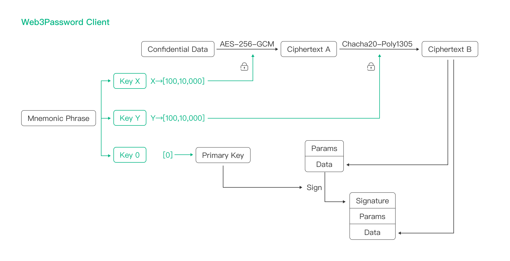
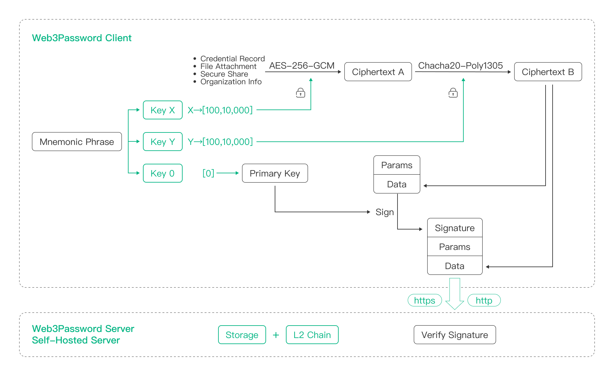
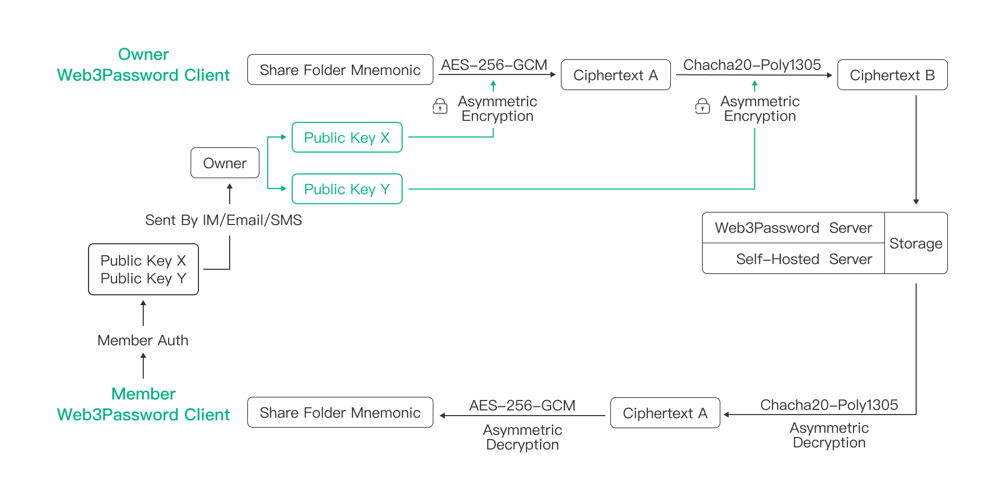

# Web3Password 安全白皮书

## 缘起

> 2022年， 一家密码管理器公司被黑客入侵导致全部数据被盗，事后发现部分数据甚至明文存储，即使是加密存储的数据，也因为用户的 Master Password 太弱，后续导致了不可估算的损失。因为这个事件，Web3Password 创始团队基于我们的信息安全经验和对区块链的研发能力，设计了一套全新的可以应用于密码管理器产品的身份认证和数据加密的零信任技术方案(Zero Trust Architecture, ZTA)。基于这样的零信任技术方案，我们带来了一款革命性的密码管理器产品 - Web3Password。

> 在加密货币领域，人们普遍使用基于 Bitcoin 的 BIP39/BIP44 助记词(Mnemonic Phrase)来保护他们的加密货币资产，目前有高达7000亿美金的加密货币都由这套助记词进行保护，并且从未发生过任何由于助记词自身的安全问题导致的加密货币被盗窃事件，这套助记词已经被充分证明是强大，安全和有效的，因此我们有充分的理由相信基于BIP39助记词的 Web3Password 足以保护你的数据安全，也能从根本上解决你对密码管理器产品的安全担忧和隐私担忧。

## Web3Password 的账户安全原理

- 一个基于 Bitcoin 的账号体系

> 出于对 Bitcoin 相关区块链技术的深厚理解，Web3Password 团队创新的将 Bitcoin 中广泛使用的 BIP39/BIP44 助记词引入到 Web3Password 的账户体系中，使用它完整实现了一个基于 ECDSA 签名的 Passkey 账户逻辑，基于这种实现，Web3Password 提供了一个有 Bitcoin 背书的账户体系，使得 Web3Password 的账户体系变得跟 Bitcoin 一样安全。同时，你的这个助记词不在任何网络传输，只在你的设备端存储和使用，Web3Password 也无法访问他。

> 基于这样创新技术方案，在 Web3Password 的产品体系里面，不会再出现传统产品需要的 Email, SMS, Password，OTP 或者 双因子验证(2FA) 之类的不安全的认证逻辑，也把 Master Password 这种不安全的设计彻底的从密码管理器产品中移除了，并且彻底解决了使用 Master Password 面临的暴力破解安全问题和工程实现安全问题，也彻底解决了cookie 和 token 会话被劫持的安全问题。

- 移除账户跟数据安全的关联

> 基于我们的信息安全经验，Web3Password 团队采用了对服务器完全不信任的设计架构。在密码管理器产品中创新的采用了将账户体系和加密密钥分离的设计，让他们之间不再产生任何关联，这样即使 Web3Password 的全部服务器或者 Web3Password 团队的全部设备被黑客完全控制，也不会对用户数据带来任何的安全影响。

> 同时基于完整的零信任技术架构的实践，在 Web3Password 产品里面，跟用户相关的任何数据，哪怕是你自定义的组织名字或共享文件夹名字，我们都使用了只有你的设备上才持有的密钥进行多重加密来保护你的数据安全。

## Web3Password 的数据安全原理

- 彻底抛弃使用慢哈希根据主密码(Master Password)派生密钥的设计

> 最近几年，随着 AI 的进步和 GPU/ASIC 算力的爆炸式增长，以及各种早期设计缺陷导致的安全漏洞问题，密码管理器行业根据用户主密码(Master Password) 使用 PBKDF2/Argon2 这些慢哈希派生密钥的迭代次数 (PBKDF2/Argon2 rounds)，已经从几年前的 10万 次，增加到了 60万 次，甚至 100万 次，但是我们认为从主密码派生密钥的慢哈希逻辑，单纯通过增加 KDF(Key Derivation Function) 次数或者更换 KDF 算法并不能从根本上保障数据的安全性，因为多数主密码实在太弱了，并且基于历史上的多次信息安全事件的经验，我们认为在密码管理器这种用户核心数据产品中，如果不能提供面向未来的安全性，那么这种设计多半也是值得质疑的。基于这样的理念，在 Web3Password 产品中，我们完全抛弃了根据主密码使用 PBKDF2/Argon2 派生密钥的设计逻辑。

- 创新的采用了 BIP39/BIP44 私钥来加密用户数据

> 在以 Bitcoin 为代表的区块链领域，绝大多数区块链产品，都会采用 BIP39/BIP44 助记词来实现自己的账户体系，多数区块链的用户也会使用 BIP39/BIP44 助记词来保护自己的加密货币。基于对区块链技术的深厚造诣，Web3Password 团队创新的将 BIP39/BIP44 助记词中用于保护加密货币的私钥引入密码管理器领域来加密用户的数据，从而达到使用户的数据跟 Bitcoin 一样安全的目标。

- 创新的使用交叉加密的设计来避免算法漏洞

> 从历史上的安全事故中可以看到，很多广泛采用的基础设施，可能都存在一些被人为故意植入的安全漏洞。所以很多安全专家和密码学家都会怀疑加密算法的安全性，更会怀疑某些政府和机构会涉足算法和基础设施的设计过程，然后在一些算法和基础设施中故意设计一些缺陷或植入漏洞。

> 基于这样的经验和教训，同时得益于 BIP39/BIP44 的良好设计，为了让 Web3Password 产品具有良好的面向未来的安全性，Web3Password 团队认为有必要对用户机密数据使用不同密钥以及不同加密算法进行交叉加密，来预防可能的算法安全性问题，确保密码管理器产品始终具有良好的面向未来的安全性。

> 经过 Web3Password 工程团队的评估，我们目前选择了密码学社区广泛推荐的 AES-256-GCM 和 Chacha20-Poly1305 两种支持 256 位密钥的加密算法用于用户机密数据的交叉加密。同时依托 Web3Password 强大的工程设计能力，我们在产品工程设计中，预留了良好的拓展性，确保 Web3Password 在需要的时候，可以引入新的安全算法来加密用户数据。

- 彻底解决通信安全问题和存储安全问题

> 基于优秀的 BIP39/BIP44，我们只在用户的设备端处理用户的明文数据(plaintext data)。所有数据在离开用户的设备之前，我们都使用了交叉加密来保障用户的数据安全，并且使用 ECDSA 算法对用户的数据进行签名来保障数据的完整性。因为 BIP39/BIP44 密钥的不可预测性，我们可以尽最大程度保障用户数据即使在不安全的网络传输也不会影响用户数据的安全，也可以保障用户数据即使存储在不安全的服务器也不会影响用户的数据安全。基于这样的安全性原理，我们会默认把用户(部分用户）数据存储在区块链来保障用户对于数据的所有权。

> 同时基于 Web3Password 强大的数据安全和完整性保障，存在中间人攻击的端对端加密(E2EE)传输已经被 Web3Password 抛弃了。

## Web3Password 的数据共享安全原理

> 在 Web3Password 共享中心，用户可以创建自己的共享文件夹(称为 Share Folder)，并且邀请任意的家人或朋友或同事加入自己的共享文件夹，这样就可以跟家人或朋友或同事共享自己的机密数据了。

> 基本原理是在创建每一个 Share Folder 时，文件夹的创建者(称为 Owner)的设备端都会生成一组新的助记词(称为 Share Folder Mnemonic), 然后会使用 Owner 的密钥对这个 Share Folder Mnemonic 进行加密，然后把密文存放到服务器里面。当 Owner 在向 Share Folder 导入共享记录时，会使用 Share Folder Mnemonic 派生的多条密钥对记录进行交叉加密，然后把密文存入服务器作为映射记录。

> 当 Owner 邀请一个 Member 加入的时候，通过解析 Member 提供的 Member Auth 参数得到 Member 的多个公钥，然后 Owner 使用 Member 的多个公钥对 Share Folder Mnemonic 进行交叉加密，把加密的 Share Folder Mnemonic 存入服务器，这样服务器会建立 Member 和 加密以后的 Share Folder Mnemonic 的映射关系。

> 在 Member 在访问共享记录的时候，就可以从 Share Folder 获取映射关系，从而获取使用 Member 公钥加密的 Share Folder Mnemonic，这时使用 Member 私钥就可以在客户端对 Share Folder Mnemonic 密文进行解密，得到 Share Folder Mnemonic 明文，因此 Member 就可以轻松在客户端解密从服务器获取的加密共享记录数据了。Owner 也可以随时吊销 Member 的访问权限。

## Web3Password 的透明协议原理

> Web3Password 清楚的知道用户对密码管理器产品后门的担忧，我们也希望通过我们的努力解决你的担忧。基于这样的考虑，依托 Web3Password 先进的账户体系和强大的数据加密体系，设计了一套同时满足安全性，又能保护用户隐私，同时还能方便第三方进行审计的通信协议。

> 在 Web3Password 的通信设计中，我们完全抛弃了传统的 cookie 和 token 的设计，改用了跟 Bitcoin 一样使用 ECDSA 签名来保障通信内容的完整性和安全性。这样就可以保障说使用 Web3Password 的产品，用户即使完全使用 HTTP 通信，第三方也完全不能篡改用户的通信内容。同时得益于 Web3Password 领先一个纬度的安全自信，我们能够自豪的说即使第三方捕获了通信内容，也不会对用户的数据带来任何的安全威胁。

> 基于这些的先进性，Web3Password 做到了通信安全性和透明性的完美融合。也是得益于此，任意的第三方都可以随时随地审计 Web3Password 产品的通信内容来确保 Web3Password 没有内置任何的后门。

> 对 Web3Password 的协议审计，请参见:
> https://github.com/web3password/web3password-protocol

## Web3Password 的开源
> https://github.com/web3password

## BIP39/BIP44 科普
> https://www.youtube.com/watch?v=It6igBdMY-I

> https://www.youtube.com/watch?v=kGClNWZcYV8

> https://youtu.be/S9JGmA5_unY

> https://github.com/bitcoin/bips/blob/master/bip-0039.mediawiki

> https://github.com/bitcoin/bips/blob/master/bip-0044.mediawiki

## 致谢
> 我们感谢 Bitcoin 社区 Marek Palatinus, Pavol Rusnak, Aaron Voisine, Sean Bowe 这些伟大的算法工程师，安全工程师和密码学工程师给我们带来了助记词这样强大的技术，基于助记词我们才有机会做出 Web3Password 这样的产品，才有机会把密码管理器这样的产品的安全性做到目前人类社会的最顶端。向他们致敬!

